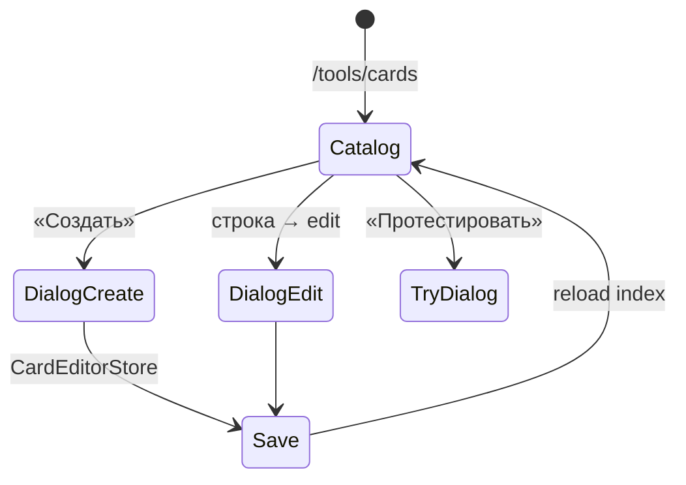

# Архитектура: редактор карточек (`card-editor`)

Каталог карточек + CRUD в dialog. Маршрут `/tools/cards`.

## Назначение

Авторинг и поиск карточек; index + payload; preview и try dialog.

## Структура

```text
features/card-editor/
├── components/
│   ├── card-editor-page/          # список + фильтры
│   ├── card-editor-dialog/        # create/edit shell
│   ├── card-form/                 # shell + kind-forms (G12)
│   ├── card-options-editor/
│   ├── lexeme-fields/
│   ├── card-preview/
│   └── card-try-dialog/
├── services/
│   └── card-editor.store.ts
└── utils/                         # validation, draft, migration
```

## Поток CRUD



## Особенности (G12)

- Режимы **Базовый / Расширенный** в dialog.
- Kind-forms: choice, input, pairs, media.
- Bilingual fields + `PhoneticLexeme` (G9/G10).
- Index meta синхронизируется при save (`CardIndexEntry`).

## Зависимости

- `shared/card-catalog-search` — `CardCatalogSearchStore`
- `core/data` — `CardSearchService`, `CardRepository`
- `shared/card-host` — preview

## Связанные документы

- [CARD-CATALOG.md](./CARD-CATALOG.md) · [EDITOR-UX.md](./EDITOR-UX.md) · [CJK-CONTENT.md](./CJK-CONTENT.md)
