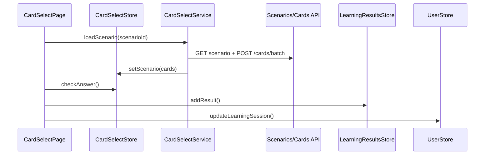

# Архитектура: практика (`card-select`)

Сессия обучения: выбор программы → урока → сценария → прохождение карточек. Маршрут `/cards/select`.

## Назначение

**Студия сессии** (G14): не dashboard, а настройка и прохождение. Dashboard — [ARCHITECTURE.home.md](./ARCHITECTURE.home.md).

## Структура

```text
features/card-select/
├── components/
│   ├── card-select-page/      # вкладки, session bar, stepper
│   ├── practice-session-bar/
│   └── practice-stepper/
├── services/
│   ├── card-select.service.ts # загрузка сценария, batch cards
│   └── card-select.store.ts   # сессия: index, feedback, direction
└── card-select.smoke.spec.ts
```

## Поток данных



## UI (G14)

| Элемент         | Компонент                               |
| --------------- | --------------------------------------- |
| Sticky контекст | `app-practice-session-bar`              |
| Шаги            | `app-practice-stepper`                  |
| Вкладки         | Программа / Уроки / Сценарии / Обучение |
| Карточка        | `app-card-host` в centered zone         |

Deep links: `?courseId&lessonId&scenarioId&tab=learning|scenarios|lessons|course&difficulty=beginner|intermediate|advanced`.

### Open practice (opt-in)

Курс может задать `practiceSettings` (`CoursePracticeSettings`):

| Поле | По умолчанию | `open` (интервью) |
| ---- | ------------ | ----------------- |
| `mode` | `guided` | `open` |
| `requireLessonForScenarios` | `true` | `false` — сценарии без урока |
| `enforceLessonPrerequisites` | `true` | `false` — все уроки кликабельны |
| `allowDifficultyFilter` | `false` | `true` — chips уровня на вкладке «Сценарии» |

Demo/radicals без `practiceSettings` — поведение без изменений. Home/resume остаётся linear.

## Зависимости

- `shared/`: course-picker, lesson-picker, scenario-picker, card-host
- `core/`: UserStore, LearningResultsStore, CourseSearchService, CardSelectService

## Связанные документы

- [BUSINESS.md](./BUSINESS.md) · [DOMAIN.md](./DOMAIN.md#learning-home-g13) · [SCENARIO-BUILDER.md](./SCENARIO-BUILDER.md)
