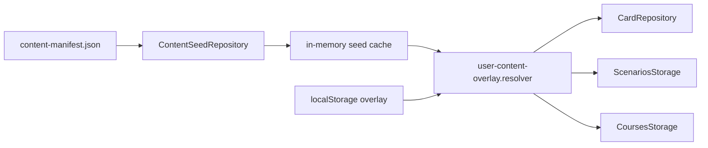
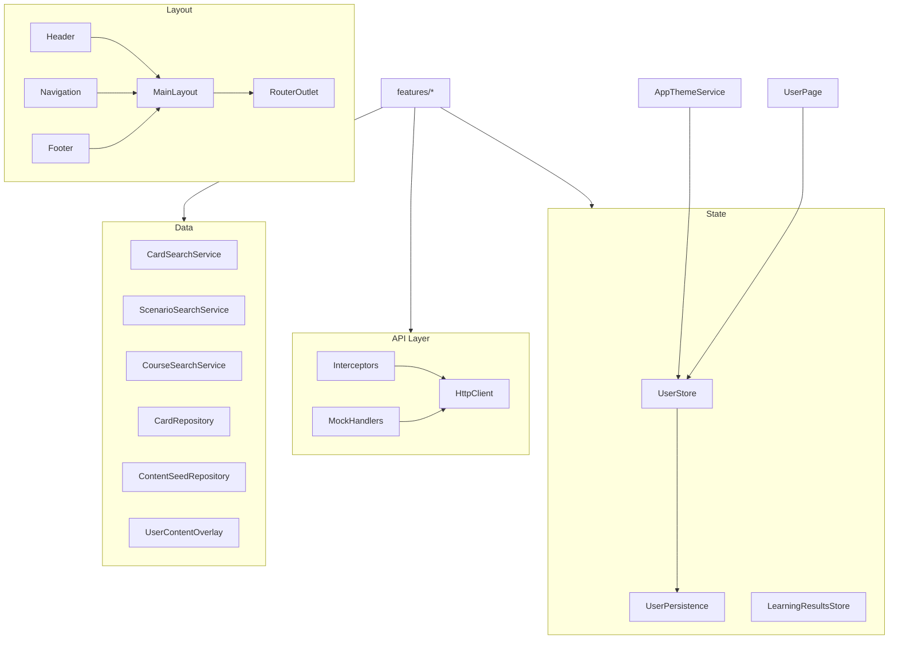

# Архитектура: `core`

Ядро приложения: layout, модели, состояние, API, данные, тема, безопасность. Оглавление: [INDEX.md](./INDEX.md) · обзор: [ARCHITECTURE.md](./ARCHITECTURE.md).

## Назначение

Singleton-сервисы и инфраструктура, **не зависящие** от конкретных фич. Фичи импортируют `core/`, но не наоборот.

## Структура

```text
src/app/core/
├── api/           # HttpClient, interceptors, mock handlers
├── data/          # репозитории, search-сервисы, утилиты домена
├── layout/        # shell, navigation, user/help pages
├── models/        # типы домена (см. DOMAIN.md)
├── security/      # санитизация ввода
├── state/         # UserStore, LearningResultsStore, persistence
└── theme/         # AppThemeService, colorScheme
```

## Компоненты layout

| Компонент             | Путь                     | Роль                                                |
| --------------------- | ------------------------ | --------------------------------------------------- |
| `MainLayoutComponent` | `layout/main-layout`     | Grid shell + `router-outlet`                        |
| `HeaderComponent`     | `layout/header`          | Шапка, menu-\*                                      |
| `NavigationComponent` | `layout/navigation`      | Боковое меню                                        |
| `UserPageComponent`   | `layout/pages/user-page` | Профиль: имя, уровень подготовки, пары языков, тема |

## Состояние

| Store                  | Ключ persistence               | Назначение                                                                 |
| ---------------------- | ------------------------------ | -------------------------------------------------------------------------- |
| `UserStore`            | `lingua-code.user`             | Пользователь, `UserPreferences`, `learningProficiencyLevel`, языковые пары |
| `LearningResultsStore` | `lingua-code.learning-results` | Ответы, прогресс по сценариям/урокам/программам                            |
| User content overlay   | `lingua-code.user-content.v1`  | Пользовательские правки courses / lessons / scenarios / cards поверх seed  |

## Content seed + overlay

Системный контент загружается один раз через **`ContentSeedRepository`** по манифесту `public/data/content-manifest.json` (списки JSON для карточек, сценариев, программ). Кэш в памяти — `content-seed.cache.ts`.

Пользовательские изменения (CRUD в редакторах) сохраняются в **`UserContentOverlay`** (`user-content-overlay.storage.ts`). При чтении каталога seed **мерджится** с overlay (`user-content-overlay.resolver.ts`); удаления системных сущностей — через `deletedSystemIds`.

Миграция при первом запуске: legacy ключи `lingua-code.cards`, `lingua-code.scenarios`, `lingua-code.course-catalog`, `lingua-code.card-index-meta` → единый overlay (`user-content-overlay.migration.ts`).

Экспорт overlay обратно в репозиторий: `npm run export:content-seed`.



## API (mock + HTTP)

- Interceptors: auth, error, mock для cards/scenarios/courses в dev.
- Search-сервисы: `CardSearchService`, `ScenarioSearchService`, `CourseSearchService` в `core/data/`.

## Диаграмма компонентов (UML)



## Особенности

- **Signals** — основной API состояния; RxJS только на границе HTTP.
- **Standalone** — без NgModule.
- **Lazy routes** — фичи не загружаются в `core`.
- **Theme** — `colorScheme` из `UserStore` → классы `theme-light` / `theme-dark` на `<html>`.

## Связанные пути (overlay + seed)

```
src/app/core/data/content-seed.repository.ts
src/app/core/data/content-seed.cache.ts
src/app/core/data/user-content-overlay.types.ts
src/app/core/data/user-content-overlay.storage.ts
src/app/core/data/user-content-overlay.resolver.ts
src/app/core/data/user-content-overlay.migration.ts
public/data/content-manifest.json
scripts/export-content-seed.mjs
```

## Связанные документы

- [DOMAIN.md](./DOMAIN.md#модели) · [ARCHITECTURE.md](./ARCHITECTURE.md) · [LANGUAGE-PAIR.md](./LANGUAGE-PAIR.md)
