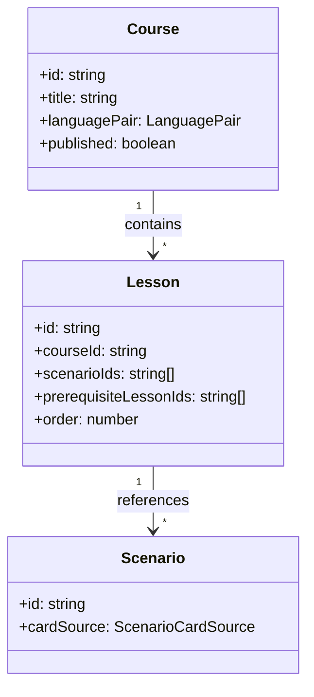

# Архитектура: программы (`course-builder`, `course-catalog`)

Учебные программы (`Course`) и уроки (`Lesson`). Маршруты `/tools/courses`, `/courses`.

## Назначение

- **course-builder** — CRUD программ и уроков для авторов.
- **course-catalog** — каталог опубликованных программ для выбора в практике.

## Структура

```text
features/course-builder/     # /tools/courses
features/course-catalog/     # /courses (published)
core/data/course-search.service.ts
core/models/course.types.ts, lesson.types.ts
```

## Иерархия



## Прогресс

- `LearningResult.courseId`, `lessonId` — агрегация в `LearningResultsStore`.
- Prerequisites уроков — `lesson-prerequisites.utils`.

## Связанные документы

- [DOMAIN.md](./DOMAIN.md#иерархия-контента) · [ARCHITECTURE.home.md](./ARCHITECTURE.home.md)
