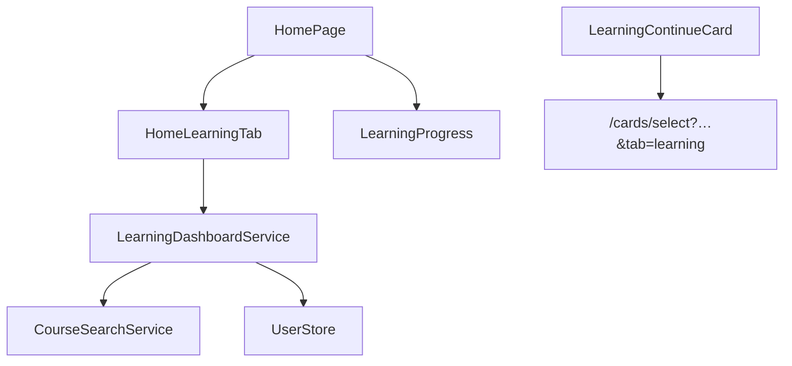

# Архитектура: обучение (`home`)

Dashboard «куда идти дальше». Маршрут `/home`, вкладка прогресса `/home/progress`.

## Назначение

Ответ на вопрос **что делать дальше** без дублирования pickers практики (G13).

## Структура

```text
features/home/
├── components/
│   ├── home-page/                 # router-outlet для tabs
│   ├── home-learning-tab/         # dashboard по умолчанию
│   ├── learning-continue-card/
│   ├── learning-program-progress/
│   └── learning-lesson-roadmap/
├── services/
│   └── learning-dashboard.service.ts
└── home-learning.smoke.spec.ts
```

## Компоненты dashboard

| Компонент                   | Данные                                       |
| --------------------------- | -------------------------------------------- |
| `learning-continue-card`    | `learning-resume.utils` → CTA + query params |
| `learning-program-progress` | `LearningResultsStore.courseProgress`        |
| `learning-lesson-roadmap`   | уроки, prerequisites, locked/done            |

## Диаграмма



## Persistence

`UserLanguagePairSettings.learning` — `activeCourseId`, `lastLessonId`, `lastScenarioId`. Обновляется из практики при ответах.

## Связанные документы

- [DOMAIN.md](./DOMAIN.md#learning-home-g13) · [LANGUAGE-PAIR.md](./LANGUAGE-PAIR.md#learning-home-g13) · [ARCHITECTURE.card-select.md](./ARCHITECTURE.card-select.md)
