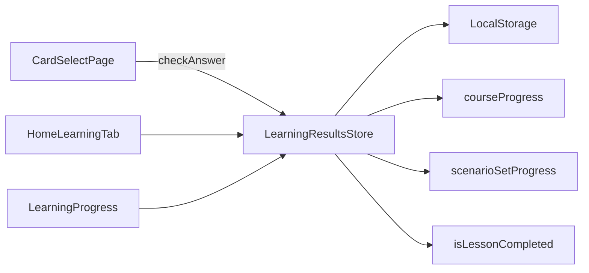

# Архитектура: результаты обучения (`learning-results`)

Сохранение ответов и отображение статистики. Маршрут `/home/progress`.

## Назначение

Фиксация `LearningResult` при каждом ответе; агрегация прогресса по сценарию, уроку, программе.

## Структура

```text
core/state/learning-results.store.ts
core/models/learning-result.types.ts
features/learning-results/components/learning-progress/
```

## Модель

```typescript
type LearningResult = {
  id: string;
  userId: string;
  cardId: string;
  scenarioId: string;
  correct: boolean;
  answeredAt: string;
  languagePair: LanguagePair;
  direction?: CardDirection;
  lessonId?: string;
  courseId?: string;
};
```

## Диаграмма



## API store (ключевые методы)

| Метод                 | Назначение                            |
| --------------------- | ------------------------------------- |
| `addResult`           | Запись ответа                         |
| `resultsForScenario`  | История по сценарию                   |
| `scenarioSetProgress` | completed/total по списку scenarioIds |
| `courseProgress`      | % по программе                        |
| `isLessonCompleted`   | все сценарии урока пройдены           |

## Связанные документы

- [DOMAIN.md](./DOMAIN.md#модели) · [ARCHITECTURE.home.md](./ARCHITECTURE.home.md)
