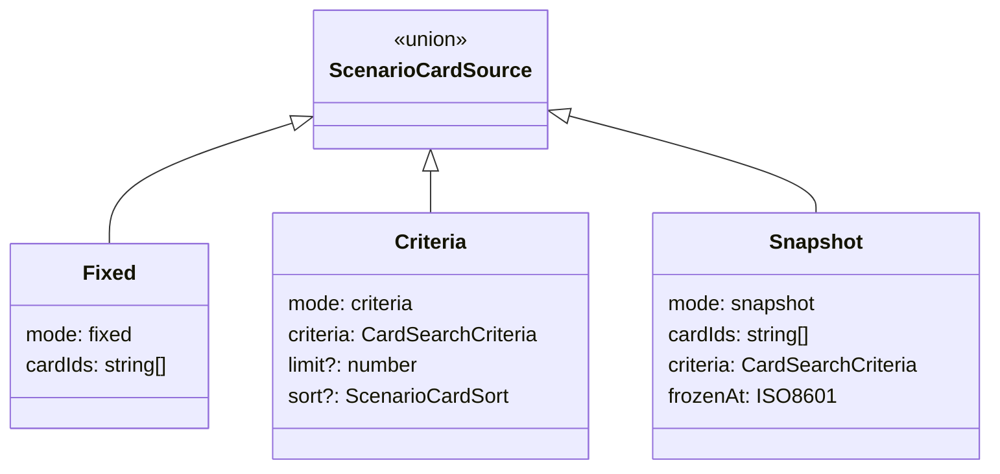

# Архитектура: конструктор сценариев (`scenario-builder`)

CRUD сценариев, `ScenarioCardSource`, публикация. Маршрут `/tools/scenario-builder`.

## Назначение

Сборка сценариев из fixed / criteria / snapshot карточек; scope по `LanguagePair`.

## Структура

```text
features/scenario-builder/
├── components/
│   ├── scenario-builder-page/
│   ├── scenario-builder-dialog/
│   ├── scenario-editor-form/
│   └── scenario-card-picker/
├── services/
│   └── scenario-builder.store.ts
```

## Модель `ScenarioCardSource`



## Особенности

- Список через `ScenarioSearchService` + pagination.
- Dialog CRUD (как card-editor).
- Read-only для чужих опубликованных сценариев (G11e multi-user).
- Прохождение — [ARCHITECTURE.card-select.md](./ARCHITECTURE.card-select.md).

## Связанные документы

- [SCENARIO-BUILDER.md](./SCENARIO-BUILDER.md) · [CARD-CATALOG.md](./CARD-CATALOG.md)
