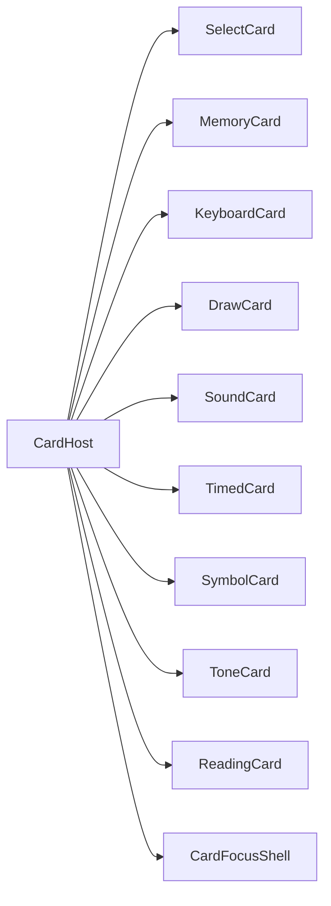
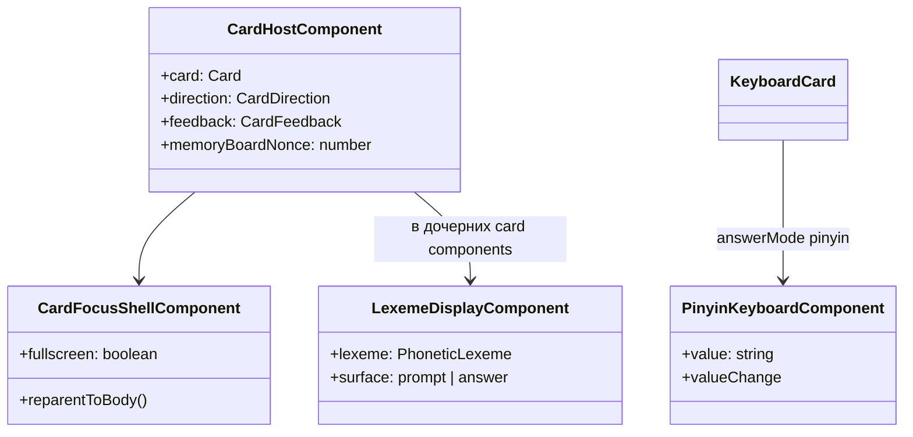

# Архитектура: `shared`

Переиспользуемые UI-компоненты, pickers, рендер карточек. [INDEX.md](./INDEX.md) · [ARCHITECTURE.md](./ARCHITECTURE.md).

## Назначение

Общие building blocks для `features/` и `core/layout/`. Без маршрутов и без store фичи.

## Основные модули

| Область         | Путь                                                           | Назначение                                      |
| --------------- | -------------------------------------------------------------- | ----------------------------------------------- |
| Card host       | `shared/components/card-host`                                  | Рендер `Card` по `kind`; `memoryBoardNonce`     |
| Focus shell     | `shared/components/card-focus-shell`                           | Fullscreen overlay; reparent host → `body`      |
| Quiz cards      | `shared/components/cards/*`                                    | Select, memory, keyboard, draw, reading…        |
| Pinyin keyboard | `shared/components/pinyin-keyboard`                            | Виртуальная клавиатура для `answerMode: pinyin` |
| Lexeme          | `shared/components/lexeme-display`, `cjk-ruby`, `phonetic-ipa` | G9/G10 отображение                              |
| Pickers         | `shared/course-picker`, `lesson-picker`, `scenario-picker`     | Выбор программы/урока/сценария                  |
| Pagination      | `shared/pagination`                                            | `UiPaginationComponent`, `PageRequest`          |
| Catalog search  | `shared/card-catalog-search`                                   | Фильтры и store поиска карточек                 |
| Utils           | `shared/utils/card-answer.utils`                               | Проверка ответов (CJK, IPA, reading fuzzy)      |

## CardHost — маршрутизация по kind

`CardFocusShellComponent` оборачивает карточку: при fullscreen host переносится в `document.body`, на `<body>` вешается класс `card-focus-shell-open`.

## Проверка ответов (`card-answer.utils.ts`)

| Kind / режим                        | Логика                                                                                                |
| ----------------------------------- | ----------------------------------------------------------------------------------------------------- |
| `select`, `timed`, `symbol`, `tone` | `correctIndex === selectedIndex` после `resolveOptionCard`                                            |
| `reading`                           | `matchesReadingCardSelection` — fuzzy match по pinyin / palladius / primary (`readingCandidateTexts`) |
| `keyboard`                          | `answerMode`: plain / pinyin / palladius / ipa / han — отдельные normalizers                          |
| `memory`                            | все пары найдены                                                                                      |
| `draw`                              | `draw-card-answer.utils` + Hanzi Engine grading                                                       |

## Pinyin keyboard

Компонент `app-pinyin-keyboard` + утилиты `core/data/pinyin-keyboard.utils.ts`:

- динамический ряд тонов над буквами (placeholder `—`, фиксированная высота);
- состояние: `committed` + `pendingSyllable` + `toneRowOpen`;
- тон ставится на **последнюю** гласную текущего слога;
- лимит слога — 6 символов (`MAX_PENDING_SYLLABLE_LENGTH`).

## Memory card

Две колонки; при переходе к следующей карточке `CardSelectStore` инкрементирует `memoryBoardNonce` → колонки перемешиваются заново (`memory-card.component.ts`).

## Диаграмма классов (упрощённо)

## Особенности

- SCSS через `--mat-sys-*` и grid layout.
- Pickers фильтруют по активной `LanguagePair` (G8).
- `LexemeDisplay.surface` — разделение «задание» / «ответы» (G9g, в работе).
- Аудио: `playLearningAudio` — сначала `audioUrl`, иначе Web Speech API (`card-learning-audio.utils.ts`).

## Связанные документы

- [CARD-CATALOG.md](./CARD-CATALOG.md) · [CJK-CONTENT.md](./CJK-CONTENT.md) · [PHONETIC-CONTENT.md](./PHONETIC-CONTENT.md)
