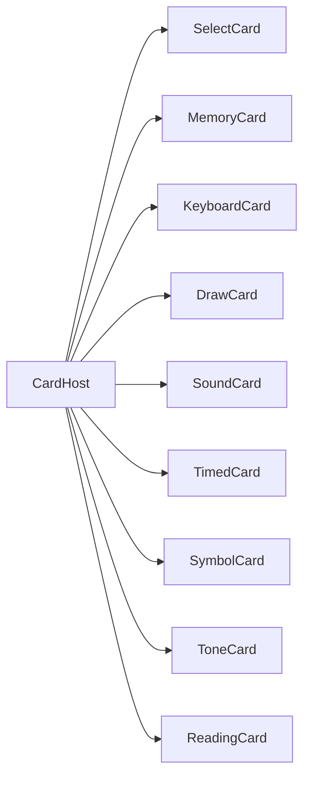
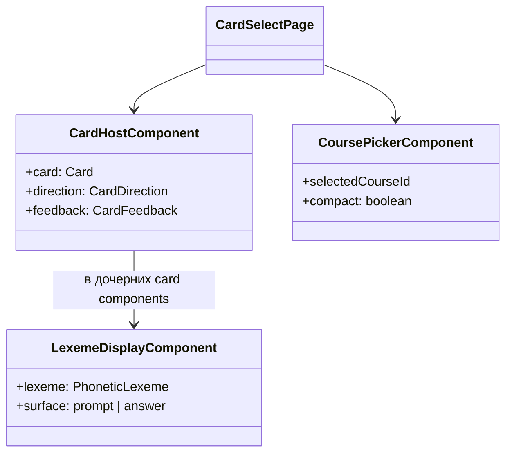

# Архитектура: `shared`

Переиспользуемые UI-компоненты, pickers, рендер карточек. [INDEX.md](./INDEX.md) · [ARCHITECTURE.md](./ARCHITECTURE.md).

## Назначение

Общие building blocks для `features/` и `core/layout/`. Без маршрутов и без store фичи.

## Основные модули

| Область        | Путь                                                           | Назначение                             |
| -------------- | -------------------------------------------------------------- | -------------------------------------- |
| Card host      | `shared/components/card-host`                                  | Рендер `Card` по `kind`                |
| Quiz cards     | `shared/components/cards/*`                                    | Select, memory, keyboard, draw…        |
| Lexeme         | `shared/components/lexeme-display`, `cjk-ruby`, `phonetic-ipa` | G9/G10 отображение                     |
| Pickers        | `shared/course-picker`, `lesson-picker`, `scenario-picker`     | Выбор программы/урока/сценария         |
| Pagination     | `shared/pagination`                                            | `UiPaginationComponent`, `PageRequest` |
| Catalog search | `shared/card-catalog-search`                                   | Фильтры и store поиска карточек        |
| Utils          | `shared/utils/card-answer.utils`                               | Проверка ответов                       |

## CardHost — маршрутизация по kind

## Диаграмма классов (упрощённо)

## Особенности

- SCSS через `--mat-sys-*` и grid layout.
- Pickers фильтруют по активной `LanguagePair` (G8).
- `LexemeDisplay.surface` — разделение «задание» / «ответы» (G9g, в работе).

## Связанные документы

- [CARD-CATALOG.md](./CARD-CATALOG.md) · [CJK-CONTENT.md](./CJK-CONTENT.md) · [PHONETIC-CONTENT.md](./PHONETIC-CONTENT.md)
