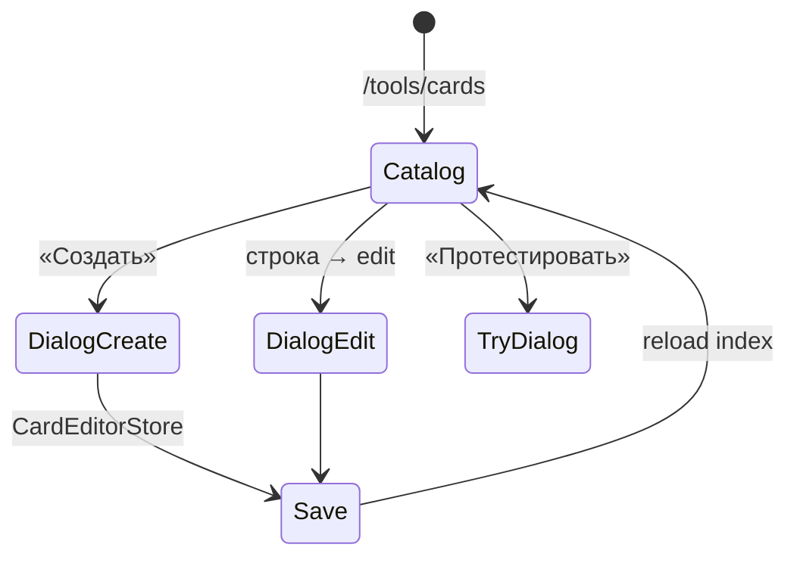

# Архитектура: редактор карточек (`card-editor`)

Каталог карточек + CRUD в dialog. Маршрут `/tools/cards`.

## Назначение

Авторинг и поиск карточек; index + payload; preview и try dialog.

## Структура

```text
features/card-editor/
├── components/
│   ├── card-appearance-fields/        # поля appearance
│   ├── card-create-wizard/            # wizard создания (G12, не подключён к dialog)
│   ├── card-editor-dialog/            # create/edit shell + basic/advanced toggle
│   ├── card-editor-discard-dialog/    # подтверждение отправки изменений
│   ├── card-form/                     # shell + kind-forms (G12)
│   ├── card-form-answers-tab/         # вкладка «Ответы»
│   ├── card-form-appearance-tab/      # вкладка «Оформление»
│   ├── card-form-content-tab/         # вкладка «Содержание»
│   ├── card-form-placement-tab/       # вкладка «Размещение»
│   ├── card-form-publishing-tab/      # вкладка «Публикация»
│   ├── card-form-phonetics-panel/     # панель фонетики (внутри content)
│   ├── card-form-tabs/                # стабильные TabId + scrollable tab bar
│   ├── card-meta-fields/              # поля индексной метаданных
│   ├── card-options-editor/           # редактор вариантов ответа
│   ├── card-preview/                  # предпросмотр карточки
│   ├── card-try-dialog/               # диалог тестирования карточки
│   └── lexeme-fields/                 # поля для иероглифов/слов
├── services/
│   └── card-editor.store.ts           # стор редактора (providedIn: component-level)
├── types/                             # типы фичи
├── utils/
│   ├── draft/                         # черновики
│   ├── form/                          # валидация форм
│   ├── index-meta/                    # индексная метаданные
│   ├── options/                       # варианты ответов
│   ├── tone/                          # тоновые утилиты
│   ├── ux/                            # UX-утилиты
│   └── validation/                    # валидация
└── index.ts                           # barrel-экспорт
```

> **Примечание:** `card-editor-page` — это страница (page), а не компонент фичи. Она расположена в `pages/card-editor/card-editor-page/` и является точкой входа маршрута `/tools/cards`. Компоненты фичи (`features/card-editor/components/`) импортируются страницей.

## Поток CRUD


```mermaid
stateDiagram-v2
  [*] --> Catalog: /tools/cards
  Catalog --> DialogCreate: «Создать»
  Catalog --> DialogEdit: строка → edit
  DialogCreate --> Save: CardEditorStore
  DialogEdit --> Save
  Save --> Catalog: reload index
  Catalog --> TryDialog: «Протестировать»
```

Из Проводника контента диалог открывается с контекстом сценария:
`openCreate(kind, context)` / `openEdit(cardId)`. После сохранения страница
обновляет старый и новый узел сценария через `refreshScenarioNode()`.

## Вкладки и стабильный `TabId`

- `card-form-tabs` экспортирует union `TabId`:
  `'content' | 'answers' | 'appearance' | 'placement' | 'publishing'`.
- `CardFormTabsComponent` эмитит `TabId`, а не индекс: выбранный индекс
  сопоставляется с `visibleTabs()[index]`.
- `CardFormComponent.tabs` объявляет видимость каждой вкладки по её `id`.
  Позиционная связка «индекс массива ↔ содержимое» удалена, поэтому скрытие
  вкладки не может сдвинуть разметку.
- Если активная вкладка становится скрытой (смена kind или режима), форма
  сбрасывается на `content`.
- `content` содержит название и prompt-поля, `answers` — kind-specific редактор
  ответов и поведение, `appearance` — тему/шрифт, `placement` — иерархию,
  `publishing` — публикацию и read-only технические метаданные.
- Бейджи ошибок вычисляет `cardDraftTabIssues` (utils/validation) на основе тех же
  правил, что и `normalizeCardDraft`.
- `CardFormTabsComponent` использует `mat-stretch-tabs="false"` и scoped SCSS:
  на узких экранах панель вкладок прокручивается по горизонтали, подписи
  обрезаются ellipsis и не ломают Material tab labels.

## Особенности (G12)

- Режимы **Базовый / Расширенный** в dialog; переключатель «Расширенный режим»
  сохраняет выбор в `sessionStorage` (`saveEditorUxMode`).
  - basic: `content`, `answers`, `placement`;
  - advanced: все пять вкладок.
- Kind-forms: choice, input, pairs, media, code-select.
- Bilingual fields + `PhoneticLexeme` (G9/G10).
- Index meta синхронизируется при save (`CardIndexEntry`).
- «Размещение» → общий `ContentHierarchySelectorComponent`
  (`entities/content-hierarchy`): пара (read-only) → курс → программа → урок →
  сценарий. Курсы фильтруются по `languagePairIds`, программы/уроки/сценарии
  берутся из `/programs/by-course`, `/lessons/by-program`,
  `/scenarios/by-lesson`. Старый `CardCatalogHierarchyService` для вкладки
  «Размещение» больше не используется. Подробности:
  [ARCHITECTURE.content-hierarchy.md](./ARCHITECTURE.content-hierarchy.md).
- Метаданные диалога: `requiredTier`, `published`, `slug` (read-only),
  `languagePairId` (read-only), иерархия `courseId → programId → lessonId → scenarioId`,
  `order`; `cardMeta` участвует в dirty-tracking.
- `CardEditorStore` публикует `lastSavedCard` — страница использует его для обновления
  дерева/выбора узла после online-save.

## Интеграция с backend

- `CardBackendAdapter` — единственная точка преобразования `Card` ↔ backend DTO:
  читает `languagePairId`, `programId`, `published`, `order`, `slug`;
  пишет `tags`, `difficulty`, `requiredTier`, иерархию, `order`, `published`.
- `CardCreateRequest` не содержит `id`/`authorId`; пустой `slug` не отправляется.
- `CardUpdateRequest.requiredTier` опционален — отправляется только при наличии значения.
- Привязка к сценарию — `ScenarioCardsService` (`POST/DELETE/PATCH /scenarios/:id/cards`),
  обёрнутый в `ScenariosApiService.addCard/removeCard/moveCard`.
- Offline: `executeWithOfflineFallback` ставит `card.create/update/delete` в sync queue,
  а метаданные сохраняются в overlay (`upsertCardIndexMetaOverride`).

## Зависимости

- `entities/card/lib/card-catalog-search/` — `CardCatalogSearchStore`
- `entities/card/` — `CardSearchService`, `CardRepository`
- `entities/chinese/ui/` — `LexemeDisplayComponent`, `PinyinKeyboardComponent` (для preview)

## Связанные документы

- [CARD-CATALOG.md](./COMMON/CARD-CATALOG.md) · [EDITOR-UX.md](./FEATURES/EDITOR-UX.md) · [CJK-CONTENT.md](./CONTENT/CJK-CONTENT.md)
