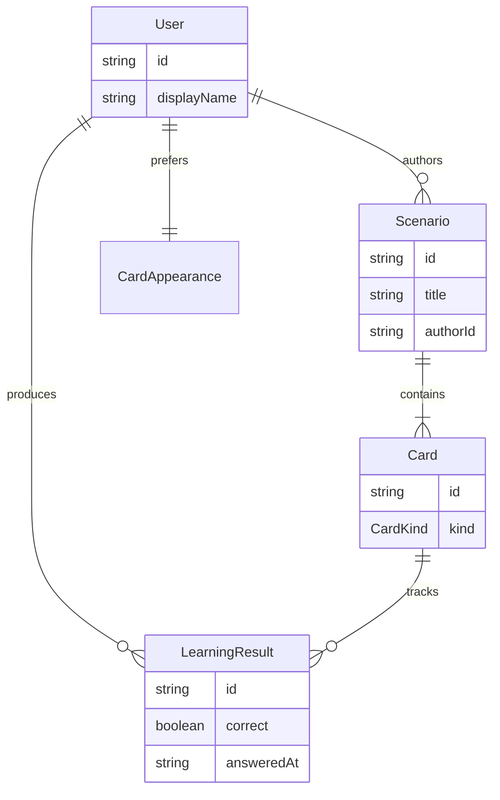

# Домен приложения LinguaCode

## Назначение

`LinguaCode` — приложение для исследования и изучения языков.

- Изучение языков от естественных до искусственных
- Основная единица приложения — **карточка**
- Карточки объединяются в **сценарии** — упорядоченный набор карточек для прохождения
- Пользователь настраивает внешний вид карточек под себя
- **Конструктор сценариев** — инструмент создания и редактирования сценариев (бэклог)
- Результаты обучения сохраняются
- Данные хранятся в базе данных

Техническая реализация: [ARCHITECTURE.md](./ARCHITECTURE.md).

## Конструктор сценариев

Инструмент для авторов и пользователей, которые собирают собственные сценарии обучения.

**Возможности (MVP):**

- создать сценарий с названием и описанием;
- добавить, удалить и упорядочить карточки (`cardSource.mode: 'fixed'`);
- задать набор по критериям каталога (`cardSource.mode: 'criteria'`);
- сохранить сценарий для прохождения в «Обучении».

**Масштабирование (бэклог):** HTTP API сценариев, пагинация списка, snapshot criteria, точечная загрузка карточек — см. [SCENARIO-BUILDER.md](./SCENARIO-BUILDER.md).

**Связь с UI:** точка входа — `menu-tools` в header и sidebar «Конструктор сценариев»; фича — `features/scenario-builder/`. Масштабирование: [SCENARIO-BUILDER.md](./SCENARIO-BUILDER.md).

## Модели

Ключевые сущности домена. Типы — `type`, не `interface`.

### Связи



### Сущности

| Модель | Описание |
|--------|----------|
| `User` | Пользователь; `displayName` и настройки внешнего вида карточек |
| `Card` | Карточка обучения; union по полю `kind` |
| `CardKind` | Тип карточки (см. таблицу ниже) |
| `CardAppearance` | Внешний вид: тема, размер шрифта и др. |
| `Scenario` | Сценарий — упорядоченный набор карточек; создаётся вручную или через конструктор |
| `LearningResult` | Результат ответа пользователя на карточку в сценарии |
| `CardIndexEntry` | Лёгкая запись каталога (метаданные без payload карточки) |
| `CardSearchCriteria` | Критерии поиска карточек в каталоге + `PageRequest` |

Подробнее о масштабировании каталога: [CARD-CATALOG.md](./CARD-CATALOG.md).

### Типы карточек (`CardKind`)

| `kind` | Назначение | Статус |
|--------|------------|--------|
| `select` | Вопрос с выбором ответа | MVP |
| `memory` | Запоминание | бэклог |
| `symbol` | Символы | бэклог |
| `sound` | Звук | бэклог |
| `timed` | Временное ограничение | бэклог |
| `keyboard` | Ввод с клавиатуры | бэклог |
| `draw` | Рисование | бэклог |

### Базовые типы

```typescript
type ContentLanguage = 'en' | 'zh' | 'ru';

/** Известный пользователю → изучаемый. См. LANGUAGE-PAIR.md */
type LanguagePair = {
  known: ContentLanguage;
  learning: ContentLanguage;
};

type CardAppearance = {
  theme: string;
  fontSize: 'sm' | 'md' | 'lg';
};

type CardBase = {
  id: string;
  kind: CardKind;
  title: string;
  appearance: CardAppearance;
};

type SelectCard = CardBase & {
  kind: 'select';
  question: string;
  options: readonly string[];
  correctIndex: number;
};

type Card = SelectCard; // union расширяется по мере добавления фич

type Scenario = {
  id: string;
  title: string;
  description: string;
  authorId: string;
  cardSource: ScenarioCardSource;
};

type LearningResult = {
  id: string;
  userId: string;
  cardId: string;
  scenarioId: string;
  correct: boolean;
  answeredAt: string; // ISO 8601
};

type User = {
  id: string;
  displayName: string;
  preferences: CardAppearance & {
    languagePairs: readonly UserLanguagePairEntry[];
    activeLanguagePairId: string;
  };
};
```

Подробнее о паре языков: [LANGUAGE-PAIR.md](./LANGUAGE-PAIR.md).

### Каталог карточек (масштаб)

Для больших объёмов карточек полный `Card` не загружается в списки — только индексная запись:

```typescript
type ContentLanguage = 'en' | 'zh' | 'ru';

type CardDifficulty = 'beginner' | 'intermediate' | 'advanced';

type CardIndexEntry = {
  id: string;
  kind: CardKind;
  title: string;
  knownLanguage: ContentLanguage;
  learningLanguage: ContentLanguage; // target — см. LANGUAGE-PAIR.md
  difficulty: CardDifficulty;
  tags: readonly string[];
  updatedAt: string; // ISO 8601
};

type PageRequest = { page: number; pageSize: number };

type CardSearchCriteria = {
  query?: string;
  knownLanguage?: ContentLanguage;
  learningLanguage?: ContentLanguage;
  difficulty?: CardDifficulty;
  kinds?: readonly CardKind[];
  tags?: readonly string[];
  page: PageRequest;
};

type ScenarioCardSource =
  | { mode: 'fixed'; cardIds: readonly string[] }
  | { mode: 'criteria'; criteria: Omit<CardSearchCriteria, 'page'>; limit?: number };
```

Расположение в коде: `src/app/core/models/` (общие типы), `src/app/shared/pagination/` (`PageRequest`, `PageResponse`), `src/app/features/*/types/` (типы фичи).

## Связанные документы

- [ARCHITECTURE.md](./ARCHITECTURE.md) — слои, layout, роутинг, фичи
- [CARD-CATALOG.md](./CARD-CATALOG.md) — индекс, поиск, пагинация каталога
- [SCENARIO-BUILDER.md](./SCENARIO-BUILDER.md) — масштабирование конструктора сценариев
- [LANGUAGE-PAIR.md](./LANGUAGE-PAIR.md) — пара языков known → learning
- [TASKS.md](../TASKS.md) — чеклист реализации
- [README.md](../README.md) — обзор проекта
