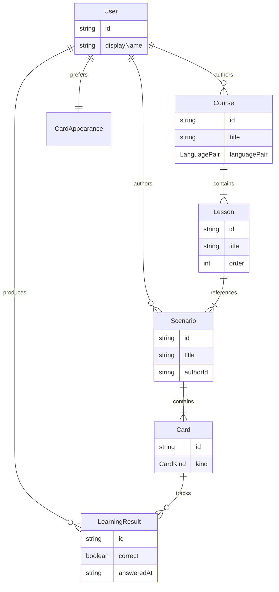

# Домен приложения LinguaCode

Доменная модель: сущности, типы, связи и терминология. Продуктовое видение и бизнес-идеи — в [BUSINESS.md](./BUSINESS.md). Оглавление документации — [INDEX.md](./INDEX.md).

## Назначение

`LinguaCode` — приложение для исследования и изучения языков. Основная единица домена — **карточка** (`Card`); карточки объединяются в **сценарии** (`Scenario`), сценарии — в **уроки** (`Lesson`), уроки — в **программы** (`Course`).

> **Статус иерархии:** `Card` → `Scenario` — **реализовано** (MVP). `Lesson` и `Course` — **реализовано** (G11), см. [TASKS.md](../TASKS.md).

Техническая реализация: [ARCHITECTURE.md](./ARCHITECTURE.md).

## Иерархия контента

Учебный материал выстраивается снизу вверх:

```text
Card  →  Scenario  →  Lesson  →  Course
```

| Уровень | Сущность | Назначение | Статус |
|---------|----------|------------|--------|
| 1 | `Card` | Атомарное упражнение (вопрос, пара, ввод…) | MVP |
| 2 | `Scenario` | Один прогон: фиксированный или criteria-набор карточек | MVP |
| 3 | `Lesson` | Тема: несколько сценариев в заданном порядке | G11 |
| 4 | `Course` | Программа: несколько уроков; привязана к `LanguagePair` | G11 |

### Термины: не путать «курс» и `LanguagePair`

В UI и документации G7/G8 слово **«курс»** иногда означает **активную языковую пару** (ru→en, ru→zh) — scope контента в каталогах и обучении. В домене G11 **`Course`** — отдельная сущность: **учебная программа** из уроков.

| В речи / UI | В домене | Пример |
|-------------|----------|--------|
| языковая пара, «курс ru→en» (G7/G8) | `LanguagePair` | `{ known: 'ru', learning: 'en' }` |
| учебная программа | `Course` | «Английский A1: базовый» |
| тематический блок | `Lesson` | «Урок 3: Приветствия» |
| прогон упражнений | `Scenario` | «Демо: приветствие» |

Рекомендация для UI (G11e): активный scope подписывать **«Курс: …»** (`LanguagePair`); сущность **`Course`** в UI называть **программой** / **учебной программой**, чтобы не путать с scope.

## Learning Home (G13)

Точка входа обучения — **`/home`** (вкладка «Обучение»). Экран отвечает на вопрос **«что делать дальше»**, не дублируя пикеры с `/cards/select`.

| Элемент | Назначение |
|---------|------------|
| Hero | активный **курс** (`LanguagePair`) и **программа** (`Course`) |
| CTA «Продолжить / Начать» | deep link на `/cards/select?courseId&lessonId&scenarioId&tab=learning` |
| Прогресс программы | агрегация `LearningResultsStore.courseProgress` |
| Roadmap уроков | locked / in progress / done (`lesson-prerequisites.utils`) |
| Статистика | краткая точность; подробности — `/home/progress` |

**Persistence:** `UserLanguagePairSettings.learning` (`LearningSessionPreferences`):

```typescript
type LearningSessionPreferences = {
  activeCourseId?: string;
  lastLessonId?: string;
  lastScenarioId?: string;
};
```

**Алгоритм resume:** `learning-resume.utils` → первый непройденный сценарий в разблокированном уроке; иначе «программа завершена».

**Разделение с `/cards/select` (G14):** dashboard — hub «куда идти»; **Практика** (`/cards/select`) — студия сессии: sticky session bar, stepper, вкладки **Программа / Уроки / Сценарии / Обучение**, кнопки «Далее» / «Начать практику». Roadmap уроков только на `/home`.

## Конструктор сценариев

Инструмент для авторов и пользователей, которые собирают собственные сценарии обучения.

**Возможности (MVP):**

- создать сценарий с названием и описанием;
- добавить, удалить и упорядочить карточки (`cardSource.mode: 'fixed'`);
- задать набор по критериям каталога (`cardSource.mode: 'criteria'`);
- сохранить сценарий для прохождения в «Обучении».

**Масштабирование (бэклог):** HTTP API сценариев, пагинация списка, snapshot criteria, точечная загрузка карточек — см. [SCENARIO-BUILDER.md](./SCENARIO-BUILDER.md).

**Связь с UI:** точка входа — `menu-tools` в header и sidebar «Конструктор сценариев»; фича — `features/scenario-builder/`. Масштабирование: [SCENARIO-BUILDER.md](./SCENARIO-BUILDER.md).

## Модели

Ключевые сущности домена. Типы — `type`, не `interface`.

### Связи



> `Lesson` и `Course` — **реализовано** (G11). Полная union `Card` — см. `card.types.ts` (9 kind).

### Сущности

| Модель | Описание | Файл типов |
|--------|----------|------------|
| `User` | Пользователь; `displayName`, `UserPreferences` | `user.types.ts` |
| `UserPreferences` | `CardAppearance`, `colorScheme`, языковые пары | `user.types.ts` |
| `UserLanguagePairEntry` | Пара + settings (CJK, IPA, learning) | `user-language-pair.types.ts` |
| `Card` | Карточка; union по `kind` | `card.types.ts` |
| `CardKind` | Тип карточки (см. таблицу ниже) | `card.types.ts` |
| `PhoneticLexeme` | Лексема (han, pinyin, ipa…) | `phonetic-content.types.ts` |
| `Scenario` | Сценарий; `cardSource` | `scenario.types.ts` |
| `ScenarioCardSource` | `fixed` / `criteria` / `snapshot` | `scenario-card-source.types.ts` |
| `Lesson` | Урок программы | `lesson.types.ts` |
| `Course` | Учебная программа | `course.types.ts` |
| `LearningResult` | Результат ответа | `learning-result.types.ts` |
| `LearningSessionPreferences` | activeCourseId, lastLessonId, lastScenarioId | `learning-session.types.ts` |
| `CardIndexEntry` | Запись каталога | `card-index.types.ts` |
| `CardSearchCriteria` | Критерии поиска | `card-search.types.ts` |

Реэкспорт: `src/app/core/models/index.ts`.

Подробнее о масштабировании каталога: [CARD-CATALOG.md](./CARD-CATALOG.md).

### Типы карточек (`CardKind`)

| `kind` | Назначение | Статус |
|--------|------------|--------|
| `select` | Вопрос с выбором ответа | реализовано |
| `memory` | Запоминание пар | реализовано |
| `symbol` | Символы | реализовано |
| `sound` | Звук | реализовано |
| `timed` | Временное ограничение | реализовано |
| `keyboard` | Ввод с клавиатуры | реализовано |
| `draw` | Рисование | реализовано |
| `tone` | Тоны / слоги | реализовано |
| `reading` | Чтение | реализовано |

### Базовые типы

```typescript
type ContentLanguage = 'en' | 'zh' | 'ru';

/** Известный пользователю → изучаемый. См. LANGUAGE-PAIR.md */
type LanguagePair = {
  known: ContentLanguage;
  learning: ContentLanguage;
};

type CardAppearance = {
  theme: string;
  fontSize: 'sm' | 'md' | 'lg';
};

type CardBase = {
  id: string;
  kind: CardKind;
  title: string;
  appearance: CardAppearance;
};

type SelectCard = CardBase & {
  kind: 'select';
  question: string;
  options: readonly string[];
  correctIndex: number;
};

type Card = SelectCard; // union расширяется по мере добавления фич

type Scenario = {
  id: string;
  title: string;
  description: string;
  authorId: string;
  cardSource: ScenarioCardSource;
};

/** G11 — см. `core/models/lesson.types.ts` */
type Lesson = {
  id: string;
  courseId: string;
  title: string;
  description: string;
  scenarioIds: readonly string[];
  prerequisiteLessonIds: readonly string[];
  order: number;
};

/** G11 — см. `core/models/course.types.ts`. languagePair задаёт scope контента курса */
type Course = {
  id: string;
  title: string;
  description: string;
  authorId: string;
  languagePair: LanguagePair;
  lessonIds: readonly string[];
  published: boolean;
};

type LearningResult = {
  id: string;
  userId: string;
  cardId: string;
  scenarioId: string;
  correct: boolean;
  answeredAt: string; // ISO 8601
  languagePair: LanguagePair;
  direction?: CardDirection;
  lessonId?: string;   // G11 — опционально для агрегации прогресса по уроку
  courseId?: string;   // G11 — опционально для агрегации прогресса по курсу
};

type User = {
  id: string;
  displayName: string;
  preferences: CardAppearance & {
    colorScheme: 'light' | 'dark';
    languagePairs: readonly UserLanguagePairEntry[];
    activeLanguagePairId: string;
  };
};
```

Подробнее о паре языков: [LANGUAGE-PAIR.md](./LANGUAGE-PAIR.md).

### Каталог карточек (масштаб)

Для больших объёмов карточек полный `Card` не загружается в списки — только индексная запись:

```typescript
type ContentLanguage = 'en' | 'zh' | 'ru';

type CardDifficulty = 'beginner' | 'intermediate' | 'advanced';

type CardIndexEntry = {
  id: string;
  kind: CardKind;
  title: string;
  knownLanguage: ContentLanguage;
  learningLanguage: ContentLanguage; // target — см. LANGUAGE-PAIR.md
  difficulty: CardDifficulty;
  tags: readonly string[];
  updatedAt: string; // ISO 8601
};

type PageRequest = { page: number; pageSize: number };

type CardSearchCriteria = {
  query?: string;
  knownLanguage?: ContentLanguage;
  learningLanguage?: ContentLanguage;
  difficulty?: CardDifficulty;
  kinds?: readonly CardKind[];
  tags?: readonly string[];
  page: PageRequest;
};

type ScenarioCardSource =
  | { mode: 'fixed'; cardIds: readonly string[] }
  | { mode: 'criteria'; criteria: Omit<CardSearchCriteria, 'page'>; limit?: number }
  | { mode: 'snapshot'; cardIds: readonly string[]; criteria: Omit<CardSearchCriteria, 'page'>; frozenAt: string };
```

Расположение в коде: `src/app/core/models/` (общие типы), `src/app/shared/pagination/` (`PageRequest`, `PageResponse`), `src/app/features/*/types/` (типы фичи).

## Связанные документы

- [INDEX.md](./INDEX.md) — оглавление документации
- [BUSINESS.md](./BUSINESS.md) — бизнес-идеи и продуктовое видение
- [ARCHITECTURE.md](./ARCHITECTURE.md) — слои, layout, роутинг, фичи
- [ARCHITECTURE.core.md](./ARCHITECTURE.core.md) — … · полный список в [INDEX.md](./INDEX.md#техническая-документация)
- [CARD-CATALOG.md](./CARD-CATALOG.md) — индекс, поиск, пагинация каталога
- [SCENARIO-BUILDER.md](./SCENARIO-BUILDER.md) — масштабирование конструктора сценариев
- [LANGUAGE-PAIR.md](./LANGUAGE-PAIR.md) — пара языков known → learning (scope контента; не путать с `Course`)
- [CJK-CONTENT.md](./CJK-CONTENT.md) — иероглифы, романизация (пиньинь, жуинь, Палладия), тоны (G9)
- [PHONETIC-CONTENT.md](./PHONETIC-CONTENT.md) — IPA, фонетическая транскрипция (G10)
- [TASKS.md](../TASKS.md) — чеклист реализации
- [README.md](../README.md) — обзор проекта
